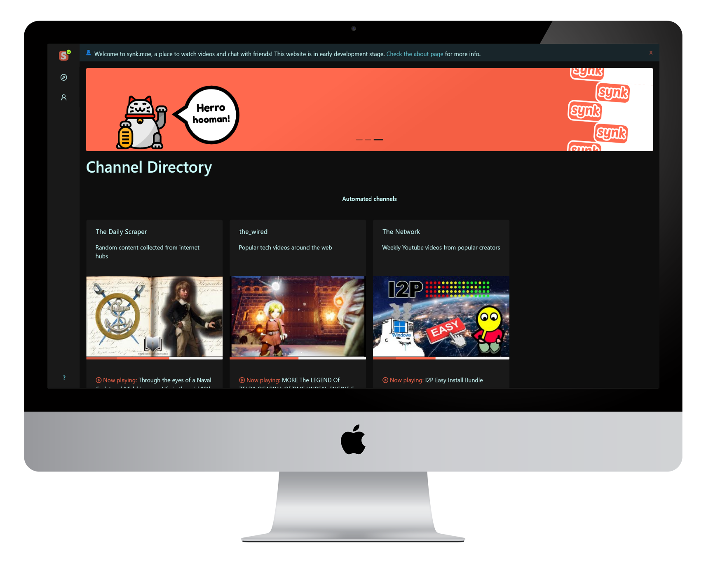

# Synk Project ~~(Stopped development due to no interest - abandoned)~~ REOPENED 

Watch videos in sync and chat with friends

     

## Live Demo

## Install

Prerequisites: 
- Have `yarn` installed
- node >= v12 installed  

Run `yarn` in all folders that contain a package.json

## Prerequisites

- NodeJS
- Postgres DB (see API .env file for DB user + execute `CREATE EXTENSION IF NOT EXISTS "uuid-ossp";` on the DB server)
- Angular cli
- Typescript

## Running

### Run from command line

Run `npm start` in the top level folder to start the Server and Client with concurrently.

**...Or** to start the client and server seperately, cd into synk-api and synk-client folders and run `npm start` 

Getting the YT namespace error in the client? Execute `npm i @types/youtube` in the synk-client folder.

### Run with Docker

> **Warning**: Running with Docker is not actively maintained/tested. These steps might work locally but haven't been used/run recently by the maintainer. 

>No need to have postgres installed when using Docker, the compose file will spin up a PostGres DB  container

Install docker and also docker-compose.

Then, in this directory, run:

`docker-compose -f "docker-compose.yml" up -d --build`

Or use the shortcut in package.json:

 `npm run docker:run`

## Powered by

### Shared tech

### Frontend

### Backend

### Contributing

